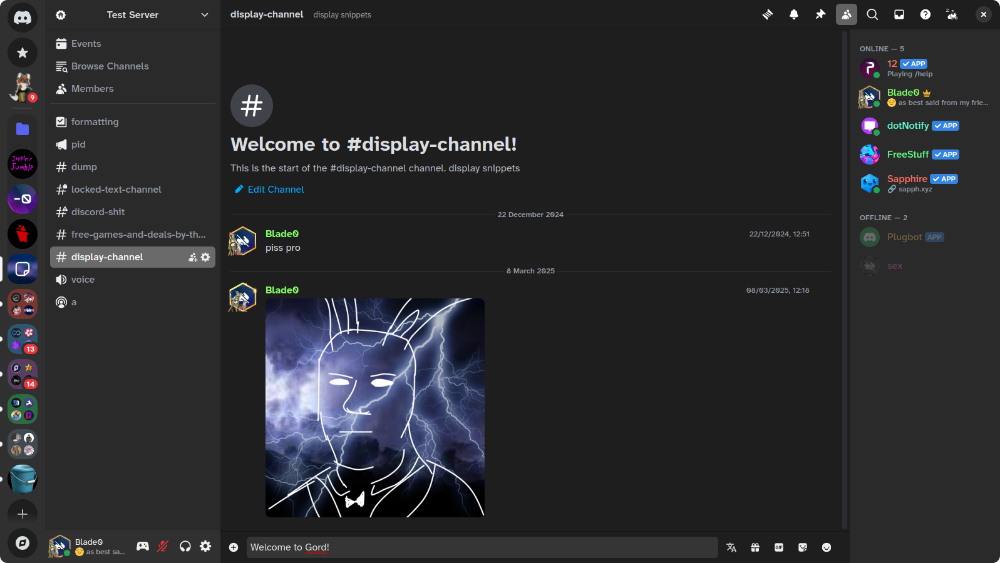

# Gord
Libadwatia/GNOME styling in discord.

    
 

## Installation

### Vencord

Download ddex4.theme.css and put it in your local themes.

If you have Vesktop, enable Native Discord Titlebar!

   
## BetterDiscord
download ddex4.theme.css and put it in your themes folder.

# Support
join server

# Contributing

you can contribute to either fix bugs, make faster, or make it closer-looking to adwatia
